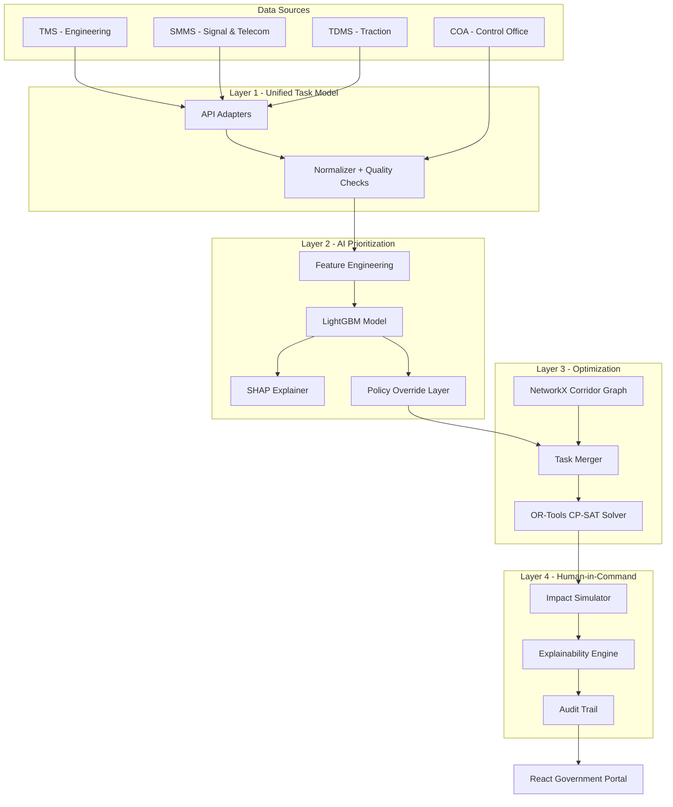

# SIH26027 — AI-Powered Automatic Block Planning System
# Smart India Hackathon 2026

> **Problem Statement ID**: 26027 | **Organization**: Ministry of Railways | **Category**: Software

## Problem Statement
The Indian Railways executes massive track maintenance across Engineering (TMS), Signal & Telecom (SMMS), and Traction (TDMS) departments. Currently, maintenance planning is siloed, leading to redundant track closures, suboptimal block durations, and schedule conflicts. Problem statement SIH26027 requires an AI-driven system to harmonize tasks across departments and optimize block planning while retaining the Human-in-Command principle.

## Solution Overview
We have engineered a 4-layer AI planning system that integrates cross-departmental data, prioritizes critical tasks using Machine Learning, resolves topological conflicts, and merges compatible tasks using constraint programming.

1. **Ingestion Layer**: Merges TMS, SMMS, TDMS tasks into a unified task model
2. **Prioritization Layer**: LightGBM scores task severity while Policy Layer enforces absolute safety rules
3. **Optimization Layer**: OR-Tools models tasks as constraints on a NetworkX spatial graph
4. **Interaction Layer**: A React frontend offering clear, explainable AI recommendations (via SHAP) for human approval

## Quick Start

### Option 1: Docker (Recommended)

```bash
# Clone and start everything with one command
docker-compose up --build

# Frontend: http://localhost:3000
# Backend API: http://localhost:8000
# API Docs: http://localhost:8000/docs
```

### Option 2: Manual Setup

```bash
# Terminal 1: Backend
cd backend
python -m venv venv
venv\Scripts\activate          # Windows
# source venv/bin/activate     # Linux/Mac
pip install -r requirements.txt
uvicorn app.main:app --reload --port 8000

# Terminal 2: Frontend
cd frontend
npm install
npm run dev
# Opens at http://localhost:5173
```

### Demo Login
| Employee ID | Password | Role |
|------------|----------|------|
| EMP-NR-001 | demo123 | Dispatcher |
| EMP-NR-002 | demo123 | Maintenance Officer |
| EMP-WR-001 | demo123 | Supervisor |
| EMP-HQ-001 | demo123 | Admin |

## Architecture Diagram


## Tech Stack
| Layer | Technology |
|-------|-----------|
| **Backend API** | FastAPI, Pydantic v2, SQLAlchemy 2.0, SQLite |
| **ML Prioritization** | LightGBM, SHAP, scikit-learn |
| **Optimization** | Google OR-Tools (CP-SAT), NetworkX |
| **Frontend** | React 18, TypeScript, Vite, TailwindCSS |
| **State Management** | Zustand, TanStack Query |
| **Visualization** | Recharts, Leaflet.js (maps), Plotly |
| **i18n** | react-i18next (English + Hindi) |
| **Export** | jsPDF, xlsx (Excel) |
| **Deployment** | Docker, docker-compose, nginx |

## Features
- ✅ Unified task ingestion across 3 departments (500+ synthetic tasks)
- ✅ Machine Learning prioritization using LightGBM
- ✅ Explainable AI (SHAP) — dispatchers see WHY a task was prioritized
- ✅ Transparent safety overrides (rail fracture = always top priority)
- ✅ Cross-department block merging using OR-Tools CP-SAT
- ✅ Corridor topology modeling with NetworkX
- ✅ Weekly + Monthly plan generation
- ✅ Impact simulation (with/without AI comparison)
- ✅ Immutable audit trail for CAG compliance
- ✅ Government portal UI (IRCTC/NTES/CRIS style)
- ✅ Hindi + English bilingual support (GIGW 3.0 compliant)
- ✅ Accessibility: font size, high contrast, screen reader, keyboard nav
- ✅ PDF + Excel export for official reports
- ✅ Interactive corridor map with Leaflet.js

## SIH26027 Pillars Addressed
| Pillar | Implementation |
|--------|---------------|
| **A. Multi-Departmental Integration** | Unified Task Model normalizes TMS/SMMS/TDMS data into common schema |
| **B. AI/ML Prioritization** | LightGBM + SHAP + Policy Layer — hybrid approach, never pure black-box |
| **C. Optimized Block Scheduling** | OR-Tools CP-SAT minimizes downtime, maximizes task merging |
| **D. Multi-Time-Horizon Planning** | Weekly (7-day) and Monthly (30-day) plan generators |

## Project Structure
```
sih-railway-ps/
├── docker-compose.yml          # One-command deployment
├── .env.example                # Environment configuration
├── README.md                   # This file
├── backend/
│   ├── Dockerfile
│   ├── requirements.txt
│   └── app/
│       ├── main.py             # FastAPI entry point
│       ├── config.py           # Settings
│       ├── database.py         # SQLAlchemy setup
│       ├── models/             # ORM models
│       ├── schemas/            # Pydantic schemas
│       ├── routers/            # API endpoints
│       ├── adapters/           # TMS/SMMS/TDMS/COA mock clients
│       ├── services/           # Business logic
│       ├── ml/                 # LightGBM + SHAP + Policy
│       ├── optimization/       # OR-Tools + NetworkX
│       ├── simulation/         # Impact simulator
│       └── data/               # Synthetic data + corridors
└── frontend/
    ├── Dockerfile
    ├── nginx.conf
    ├── package.json
    └── src/
        ├── App.tsx             # Main app with routing
        ├── components/         # 17 reusable govt-style components
        ├── pages/              # 11 full pages
        ├── services/           # API client + mock data
        ├── store/              # Zustand state management
        ├── hooks/              # TanStack Query hooks
        ├── types/              # TypeScript interfaces
        ├── utils/              # Formatters, export utilities
        └── i18n/               # English + Hindi translations
```

## API Endpoints

All endpoints are live and covered by `backend/tests`. Authenticate with
`POST /api/auth/login`, then send `Authorization: Bearer <token>`.

| Method | Endpoint | Description |
|--------|----------|-------------|
| POST | `/api/auth/login` | JWT auth — verifies the bcrypt password against `users` |
| GET | `/api/auth/me` | Current user from the token |
| GET | `/api/tasks` | Paginated tasks (filter by department, severity, status, corridor) |
| POST | `/api/tasks` | Create a task |
| GET | `/api/tasks/{id}` | Single task |
| POST | `/api/tasks/bulk-action` | Approve / reject many tasks |
| POST | `/api/prioritize` | LightGBM scoring + policy overrides, persists scores |
| GET | `/api/prioritize/results` | Tasks ranked by `priority_score` |
| GET | `/api/prioritize/shap/{task_id}` | SHAP factor contributions for one task |
| POST | `/api/optimize/weekly` | Weekly CP-SAT plan (merger → solver → `block_plans`) |
| POST | `/api/optimize/monthly` | Monthly plan |
| GET | `/api/optimize/plans` | List generated plans |
| GET | `/api/optimize/plans/{plan_id}` | Plan detail with blocks |
| POST | `/api/simulate` | With-AI vs without-AI impact simulation |
| GET | `/api/simulate/results/{plan_id}` | Cached simulation result |
| GET | `/api/audit` | Audit trail (filter by action, entity, date) |
| POST | `/api/approve` | Approve a block plan + audit entry |
| POST | `/api/reject` | Reject a block plan + audit entry |
| GET | `/api/corridors` | Corridors with sections |
| GET | `/api/corridors/kpis` | Corridor KPI register |
| GET | `/api/corridors/{id}/topology` | Station/section graph for the map |
| POST | `/api/reports/generate` | Report generation (`productivity`, `utilization`, `health`, `overdue`, `accuracy`) |
| GET | `/api/chat` | Chatbot suggested prompts |
| POST | `/api/chat` | Chatbot — answers grounded in live DB facts |
| GET | `/api/gov/datasets` | Available government open-data datasets |
| GET | `/api/gov/railway-live` | Government/railway data with 3-tier fallback |
| GET | `/api/health` | Health check |

### Chatbot
`POST /api/chat` takes `{message, history}` and returns `{reply, source, data}`.
`source` is `db` (answered from a live query), `rules` (deterministic intent +
policy answer) or `llm`. It works with **no API key configured** — set
`OPENAI_API_KEY` or `GEMINI_API_KEY` to let an LLM phrase the answer using the
same verified facts. An LLM failure always falls back to the rule answer.

### Government data
`GET /api/gov/railway-live?dataset=<key>` degrades in three tiers so a demo
never fails: bundled snapshot → keyless live source → data.gov.in (requires a
free `DATA_GOV_IN_API_KEY`). The response reports which tier answered in `source`
and explains any fallback in `note`.

## Deployment

### Backend → Render
1. Push this repo to GitHub (see below).
2. Render → **New → Blueprint** → select the repo. `render.yaml` creates the service.
3. After it is live, set `CORS_ORIGINS` in the Render environment to include your
   Vercel URL, e.g. `http://localhost:3000,http://localhost:5173,https://<app>.vercel.app`.
4. Health check: `https://<service>.onrender.com/api/health`

> SQLite on Render's free plan is ephemeral and resets on redeploy. Startup
> re-seeds automatically (500 tasks, 4 demo users, corridors, KPIs) whenever the
> tables are empty, so the app stays usable. Attach a disk or switch
> `DATABASE_URL` to Postgres for durable data.

### Frontend → Vercel
1. Vercel → **Add New Project** → import the repo.
2. Set **Root Directory** to `frontend` (Vercel auto-detects Vite; `frontend/vercel.json`
   supplies the SPA rewrite and build settings).
3. In **Project Settings → Environment Variables**, add:
   - `VITE_API_URL` = your Render service URL, e.g. `https://a-abps-api.onrender.com`
     (no trailing slash). Redeploy after setting it.
4. Leave `VITE_API_URL` unset for local dev — Vite's proxy already forwards `/api`
   to `http://localhost:8000`.

### Environment
Copy `.env.example` to `.env`. Every entry has a working default, so an empty
`.env` is enough locally. The optional keys (data.gov.in, OpenAI, Gemini) are
documented inline with free-registration steps.


## License
MIT

